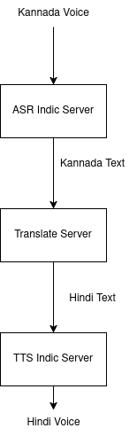

## Dhwani - Voice Mode For Kannada


- Dhwani is a self-hosted platform designed to provide Voice mode interaction for Kannada and Indian languages.

- This platform leverages various tools and models to parse, transcribe, and improve conversation ultimately providing high-quality audio interactions 

- An experiment to build a production grade inference pipeline 

- [Voice Demo](https://huggingface.co/spaces/gaganyatri/dhwani)


## Target Solution

| Answer Engine                                  | Voice Translation                          |
|-----------------------------------------------|---------------------------------------------|
|  |  |


- Demo for Testing components for Dhwani for Accuracy and evaluation
  - [Answer Engine]()
  - [Answer Engine with Translate]()
  - [pdf translate]()
  - [text_translate]()
  - [voice generation]()
  - [voice_to_text_translation]()
  - [voice_to_voice_translation]()
  - [text_query]()

  - [Answer Engine]()
  - [Answer Engine with Translate]()
  - [pdf translate]()
  - [text_translate]()
  - [voice generation]()
  - [voice_to_text_translation]()
  - [voice_to_voice_translation]()
  - [text_query]()

| Feature                      | Description                                                                 | Demo Link | Components          |
|------------------------------|-----------------------------------------------------------------------------|-----------|---------------------|
| Answer Engine                | Provides answers to queries using a large language model.                     | [Link]()  | LLM                 |
| Answer Engine with Translate| Provides answers to queries with translation capabilities.                   | [Link]()  | LLM, Translation    |
| PDF Translate                | Translates content from PDF documents.                                       | [Link]()  | Translation         |
| Text Translate               | Translates text from one language to another.                                | [Link]()  | Translation         |
| Voice Generation            | Generates speech from text.                                                  | [Link]()  | TTS                 |
| Voice to Text Translation    | Converts spoken language to text and translates it.                          | [Link]()  | ASR, Translation    |
| Voice to Voice Translation   | Converts spoken language to text, translates it, and then generates speech.   | [Link]()  | ASR, Translation, TTS|
| Text Query                   | Allows querying text data for specific information.                          | [Link]()  | LLM                 |


<!-- 

- TTS - Text to Speech
```
curl -X 'POST' \
  'https://gaganyatri-tts-indic-server-cpu.hf.space/v1/audio/speech' \
  -H 'accept: application/json' \
  -H 'Content-Type: application/json' \
  -d '{"input": "ಉದ್ಯಾನದಲ್ಲಿ ಮಕ್ಕಳ ಆಟವಾಡುತ್ತಿದ್ದಾರೆ ಮತ್ತು ಪಕ್ಷಿಗಳು ಚಿಲಿಪಿಲಿ ಮಾಡುತ್ತಿವೆ.", "voice": "A female speaker delivers a slightly expressive and animated speech with a moderate speed and pitch. The recording is of very high quality, with the speakers voice sounding clear and very close up.",, "response_type": "wav"}'  -o audio_kannada_gpu_cloud.wav
```

- ASR - Automatic Speech Recognition
```
curl -X 'POST' \
  'https://gaganyatri-asr-indic-server-cpu.hf.space/transcribe/?language=kannada' \
  -H 'accept: application/json' \
  -H 'Content-Type: multipart/form-data' \
  -F 'file=@audio_kannada_gpu_cloud.wav;type=audio/x-wav'
```


- Translate - Kannada to Hindi
```
curl -X 'POST' \
  'https://gaganyatri-translate-indic-server-cpu.hf.space/translate?src_lang=kan_Knda&tgt_lang=eng_Latn&device_type=cpu' \
  -H 'accept: application/json' \
  -H 'Content-Type: application/json' \
  -d '{
  "sentences": [
    "ನಮಸ್ಕಾರ, ಹೇಗಿದ್ದೀರಾ?", "ಶುಭೋದಯ!"
  ],
  "src_lang": "kan_Knda",
  "tgt_lang": "eng_Latn"
}'
```

-->